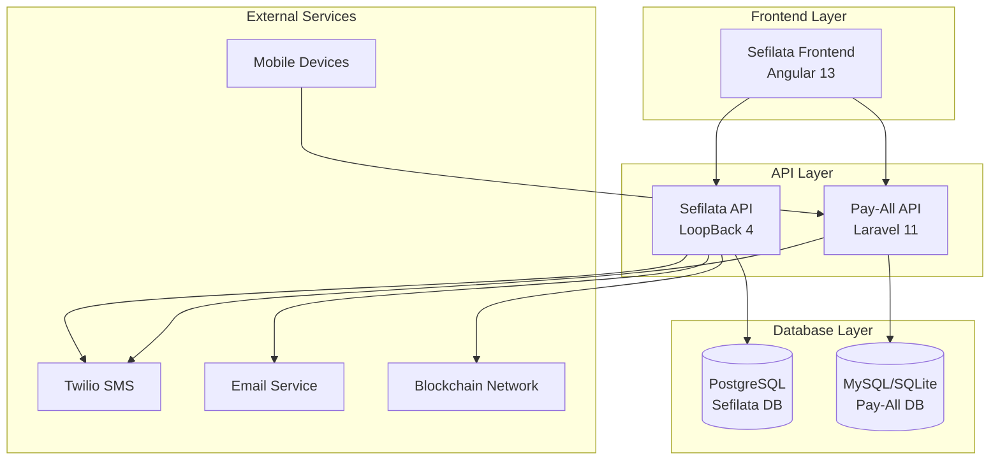
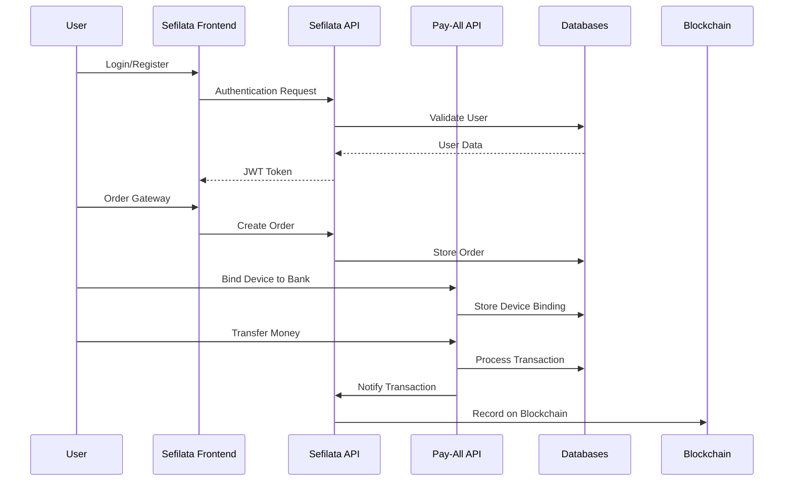
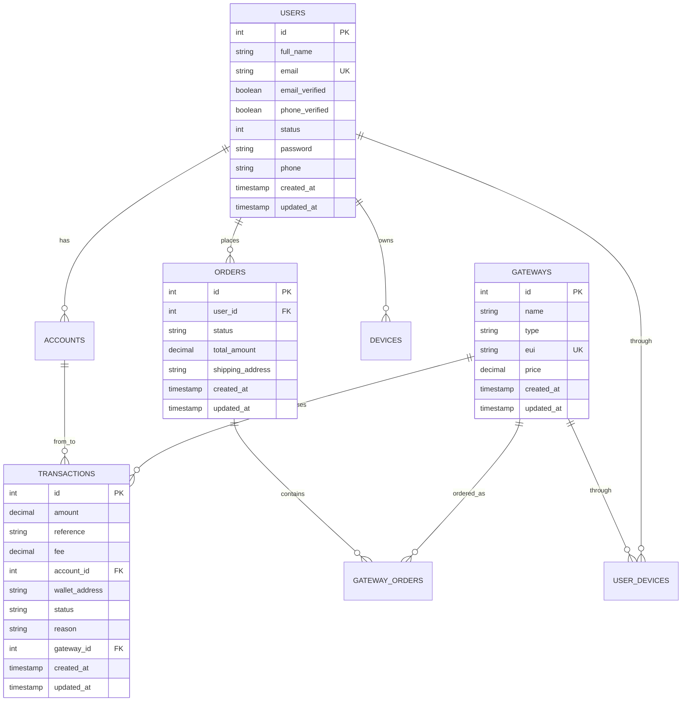
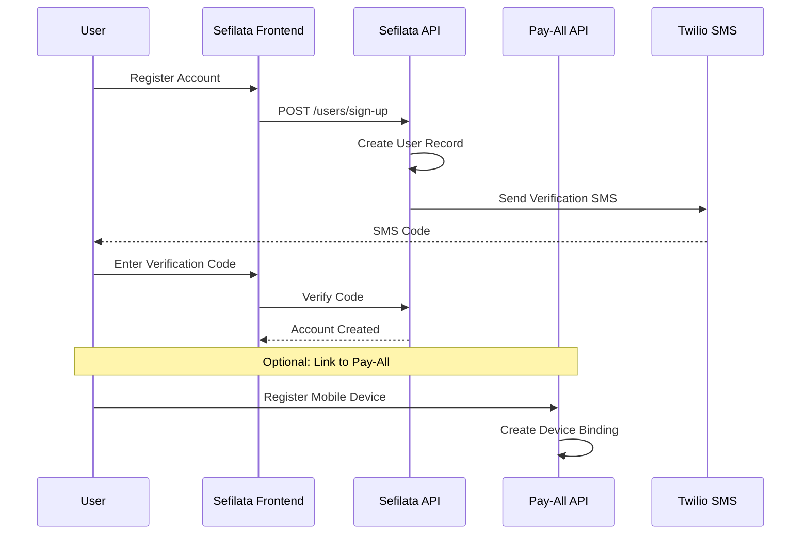
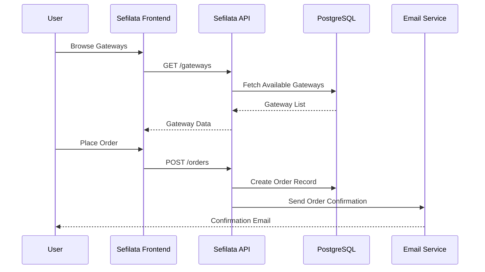
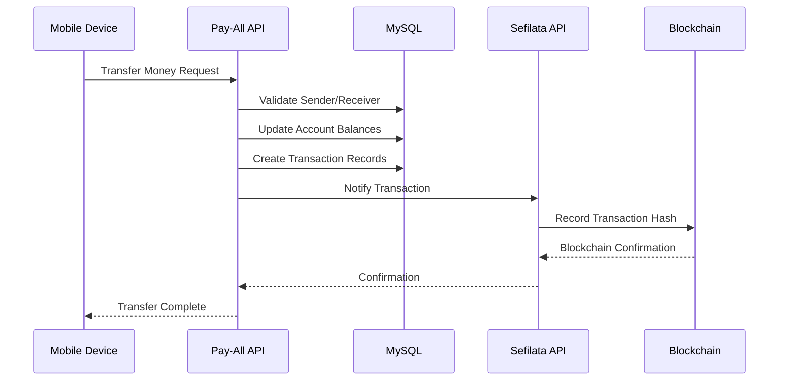
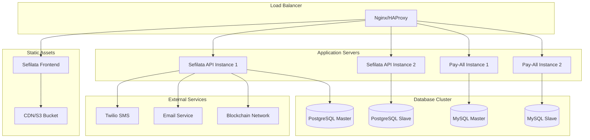

# PayAll Ecosystem: Comprehensive System Documentation

## Table of Contents
1. [Executive Summary](#executive-summary)
2. [System Architecture Overview](#system-architecture-overview)
3. [Project Breakdown](#project-breakdown)
4. [Technology Stack](#technology-stack)
5. [Database Architecture](#database-architecture)
6. [API Documentation](#api-documentation)
7. [Frontend Architecture](#frontend-architecture)
8. [Integration Flow](#integration-flow)
9. [Security Implementation](#security-implementation)
10. [Deployment Architecture](#deployment-architecture)
11. [Development Status](#development-status)
12. [Future Roadmap](#future-roadmap)

---

## Executive Summary

The PayAll Ecosystem is a comprehensive blockchain-based payment platform consisting of three interconnected applications that work together to provide a complete payment gateway solution. The system enables users to order physical payment gateways, process transactions through these devices, and manage digital wallets with blockchain integration.

### System Components:
1. **Sefilata API** - Backend API service (Node.js/LoopBack 4)
2. **Pay-All** - Mobile payment processing system (PHP/Laravel)
3. **Sefilata Frontend** - Web dashboard interface (Angular)

### Key Features:
- Physical payment gateway ordering and management
- Mobile device-to-bank account binding
- Secure money transfers between users
- Blockchain transaction recording
- Real-time transaction monitoring
- Revenue sharing for gateway owners
- Multi-platform support (Web, Mobile, API)

---

## System Architecture Overview



### Data Flow Architecture:



---

## Project Breakdown

### 1. Sefilata API (Backend Core)

**Location**: `/sefilata-api/`
**Technology**: Node.js with LoopBack 4 Framework
**Port**: 3001
**Database**: PostgreSQL

#### Purpose:
The Sefilata API serves as the central backend system managing:
- User authentication and authorization
- Gateway ordering and management
- Transaction processing and blockchain integration
- Revenue distribution
- File uploads and document management

#### Key Components:

**Models** (`/src/models/`):
- `users.model.ts` - User management and authentication
- `gateway.model.ts` - Payment gateway definitions
- `transactions.model.ts` - Transaction records with blockchain hashes
- `order.model.ts` - Gateway orders and shipping
- `accounts.model.ts` - User wallet accounts
- `device.model.ts` - Physical device management

**Controllers** (`/src/controllers/`):
- `user.controller.ts` - User CRUD operations, authentication
- `gateway.controller.ts` - Gateway management
- `transaction.controller.ts` - Transaction processing
- `order.controller.ts` - Order management and validation

**Services** (`/src/services/`):
- JWT authentication service
- Email notification service
- File upload service
- Blockchain integration service

#### Database Schema (PostgreSQL):

```sql
-- Users table
CREATE TABLE users (
    id SERIAL PRIMARY KEY,
    full_name VARCHAR(255) NOT NULL,
    email VARCHAR(255) UNIQUE NOT NULL,
    email_verified BOOLEAN DEFAULT FALSE,
    phone_verified BOOLEAN DEFAULT FALSE,
    status INTEGER DEFAULT 0,
    password VARCHAR(255) NOT NULL,
    phone VARCHAR(20),
    created_at TIMESTAMP DEFAULT NOW(),
    updated_at TIMESTAMP DEFAULT NOW()
);

-- Gateways table
CREATE TABLE gateways (
    id SERIAL PRIMARY KEY,
    name VARCHAR(255) NOT NULL,
    type VARCHAR(100) NOT NULL,
    eui VARCHAR(255) UNIQUE,
    price DECIMAL(10,2) DEFAULT 0,
    created_at TIMESTAMP DEFAULT NOW(),
    updated_at TIMESTAMP DEFAULT NOW()
);

-- Transactions table
CREATE TABLE transactions (
    id SERIAL PRIMARY KEY,
    amount DECIMAL(10,2) NOT NULL,
    reference VARCHAR(255),
    fee DECIMAL(10,2) DEFAULT 0,
    account_id INTEGER,
    wallet_address VARCHAR(255) NOT NULL,
    status VARCHAR(50) NOT NULL,
    reason TEXT,
    gateway_id INTEGER REFERENCES gateways(id),
    created_at TIMESTAMP DEFAULT NOW(),
    updated_at TIMESTAMP DEFAULT NOW()
);
```

### 2. Pay-All (Mobile Payment System)

**Location**: `/pay-all/`
**Technology**: PHP with Laravel 11 Framework
**Port**: 8000
**Database**: MySQL/SQLite

#### Purpose:
Pay-All handles the mobile payment processing and device management:
- Mobile device binding to bank accounts
- Real-time money transfers between users
- SMS verification and notifications
- Transaction history and balance management

#### Key Components:

**Models** (`/app/Models/`):
- `User.php` - Mobile app users with JWT authentication
- `Device.php` - Mobile device registration
- `Account.php` - Bank account linking
- `Transaction.php` - Money transfer records
- `BankUser.php` - Bank customer data

**Controllers** (`/app/Http/Controllers/`):
- `AuthController.php` - Mobile user authentication
- `PayController.php` - Payment processing and transfers
- `PagesController.php` - Web interface management

**Key Features**:
- Device IMEI-based authentication
- Real-time balance checking
- Secure money transfers with SMS confirmation
- Transaction history tracking
- Bank account binding and validation

#### Database Schema (MySQL):

```sql
-- Users table (Pay-All)
CREATE TABLE users (
    id INT AUTO_INCREMENT PRIMARY KEY,
    id_device BIGINT,
    id_user_ext BIGINT,
    name VARCHAR(255) NOT NULL,
    surename VARCHAR(255),
    imei VARCHAR(255),
    sexe VARCHAR(10),
    dob VARCHAR(20),
    profession VARCHAR(255),
    address TEXT,
    email VARCHAR(255) UNIQUE,
    phone VARCHAR(20) UNIQUE,
    password VARCHAR(255),
    code VARCHAR(10),
    meta_data TEXT,
    created_at TIMESTAMP DEFAULT CURRENT_TIMESTAMP,
    updated_at TIMESTAMP DEFAULT CURRENT_TIMESTAMP ON UPDATE CURRENT_TIMESTAMP
);

-- Device table
CREATE TABLE device (
    id INT AUTO_INCREMENT PRIMARY KEY,
    imei VARCHAR(255) UNIQUE NOT NULL,
    model VARCHAR(255),
    brand VARCHAR(255),
    status TINYINT DEFAULT 1,
    created_at TIMESTAMP DEFAULT CURRENT_TIMESTAMP
);

-- Account table
CREATE TABLE account (
    id INT AUTO_INCREMENT PRIMARY KEY,
    id_user INT REFERENCES users(id),
    accountno VARCHAR(255),
    balance DECIMAL(15,2) DEFAULT 0,
    id_compte_ext VARCHAR(255),
    created_at TIMESTAMP DEFAULT CURRENT_TIMESTAMP
);
```

### 3. Sefilata Frontend (Web Dashboard)

**Location**: `/sefilata-frontend/`
**Technology**: Angular 13 with TypeScript
**Port**: 4200
**UI Framework**: Angular Material + Bootstrap

#### Purpose:
The frontend provides a comprehensive web interface for:
- User registration and authentication
- Gateway ordering and management
- Transaction monitoring and analytics
- Account management and KYC verification
- Revenue tracking and reporting

#### Key Components:

**Modules** (`/src/app/modules/`):
- `auth/` - Authentication and user management
- `gateway/` - Gateway ordering and monitoring
- `transaction/` - Transaction history and analytics
- `account/` - User profile and wallet management
- `sales/` - Revenue tracking and reporting

**Services**:
- `AuthHTTPService` - API communication for authentication
- HTTP interceptors for JWT token management
- Real-time data services for dashboard updates

#### Key Features:
- Responsive dashboard with real-time updates
- Gateway status monitoring
- Transaction analytics with charts
- Document upload for KYC verification
- Multi-language support
- Mobile-responsive design

---

## Technology Stack

### Backend Technologies:

**Sefilata API**:
- **Framework**: LoopBack 4 (Node.js)
- **Language**: TypeScript
- **Database**: PostgreSQL with Sequelize ORM
- **Authentication**: JWT with bcrypt password hashing
- **File Upload**: Multer for document handling
- **Email**: Nodemailer with SMTP
- **SMS**: Twilio SDK
- **API Documentation**: OpenAPI/Swagger

**Pay-All**:
- **Framework**: Laravel 11
- **Language**: PHP 8.2+
- **Database**: MySQL/SQLite with Eloquent ORM
- **Authentication**: JWT (tymon/jwt-auth)
- **SMS**: Twilio SDK
- **Frontend**: Blade templates with TailwindCSS
- **Build Tool**: Vite

### Frontend Technologies:

**Sefilata Frontend**:
- **Framework**: Angular 13
- **Language**: TypeScript
- **UI Components**: Angular Material + Bootstrap 5
- **Charts**: ApexCharts for analytics
- **Icons**: FontAwesome + Bootstrap Icons
- **Internationalization**: ngx-translate
- **Build Tool**: Angular CLI with Webpack

### DevOps & Infrastructure:
- **Version Control**: Git
- **Containerization**: Docker support
- **Environment Management**: dotenv configuration
- **Testing**: Jest (Frontend), Mocha (Backend), PHPUnit (Laravel)
- **Code Quality**: ESLint, Prettier, PHP CS Fixer

---

## Database Architecture

### Database Relationships:



### Cross-System Data Synchronization:

The two database systems (PostgreSQL for Sefilata, MySQL for Pay-All) maintain data consistency through:

1. **User Synchronization**: Users created in Sefilata API can be linked to Pay-All users via external ID mapping
2. **Transaction Correlation**: Transactions in Pay-All trigger notifications to Sefilata API for blockchain recording
3. **Device Management**: Physical devices are registered in both systems for complete tracking

---

## API Documentation

### Sefilata API Endpoints:

#### Authentication Endpoints:
```
POST /users/sign-up
POST /users/login
POST /users/reset-password-init
POST /users/reset-password-finish
```

#### User Management:
```
GET /users/dashboard-infos
POST /users/create-account
PATCH /users/update-account
PATCH /users/update-document
PATCH /users/update-password
```

#### Gateway Management:
```
GET /gateways
GET /gateways/{id}
POST /gateways
PATCH /gateways/{id}
DELETE /gateways/{id}
```

#### Order Management:
```
POST /orders
GET /orders
GET /orders/{id}
GET /orders/{id}/validate
GET /orders/{id}/reject
```

#### Transaction Management:
```
POST /transactions
GET /user/transactions
GET /transactions/{gateway_id}/gateway
```

### Pay-All API Endpoints:

#### Authentication:
```
POST /api/auth/login
POST /api/auth/register
POST /api/auth/binding
POST /api/auth/logout
```

#### Device Management:
```
POST /api/auth/device/binding
GET /api/auth/device/user
POST /api/auth/device/user-unbind
```

#### Payment Processing:
```
POST /api/auth/device/pay
POST /api/auth/device/pay/confirm
GET /api/auth/device/balance/{imei}
POST /api/auth/device/balancecheck
GET /api/auth/device/transaction
```

---

## Frontend Architecture

### Component Structure:

```
sefilata-frontend/
├── src/app/
│   ├── modules/
│   │   ├── auth/                 # Authentication module
│   │   ├── gateway/              # Gateway management
│   │   ├── transaction/          # Transaction monitoring
│   │   ├── account/              # User account management
│   │   └── sales/                # Revenue tracking
│   ├── pages/
│   │   ├── dashboard/            # Main dashboard
│   │   └── builder/              # Page builder
│   ├── services/                 # HTTP services
│   └── _metronic/                # UI framework
```

### State Management:
- **Authentication State**: JWT token management with automatic refresh
- **User State**: Current user profile and permissions
- **Gateway State**: Real-time gateway status and statistics
- **Transaction State**: Live transaction monitoring

### Routing Structure:
```typescript
const routes: Routes = [
  { path: 'auth', loadChildren: () => import('./modules/auth/auth.module') },
  { path: 'gateway', loadChildren: () => import('./modules/gateway/gateway.module') },
  { path: 'transactions', loadChildren: () => import('./modules/transaction/transaction.module') },
  { path: 'account', loadChildren: () => import('./modules/account/account.module') },
  { path: 'sales', loadChildren: () => import('./modules/sales/sales.module') },
  { path: '', redirectTo: '/dashboard', pathMatch: 'full' }
];
```

---

## Integration Flow

### System Integration Patterns:

#### 1. User Registration Flow:


#### 2. Gateway Ordering Flow:


#### 3. Payment Processing Flow:


### Data Synchronization:

#### User Data Mapping:
- **Sefilata User ID** ↔ **Pay-All External User ID**
- **Email/Phone** used as common identifiers
- **Account Status** synchronized between systems

#### Transaction Correlation:
- Pay-All transactions trigger Sefilata API notifications
- Blockchain hashes stored in Sefilata for immutable records
- Revenue calculations updated in real-time

---

## Security Implementation

### Authentication & Authorization:

#### JWT Token Management:
```typescript
// Sefilata API - JWT Configuration
{
  secret: process.env.JWT_SECRET,
  expiresIn: '24h',
  issuer: 'sefilata-api',
  audience: 'sefilata-frontend'
}

// Pay-All - JWT Configuration
{
  'ttl' => 60 * 24, // 24 hours
  'refresh_ttl' => 60 * 24 * 7, // 7 days
  'algo' => 'HS256'
}
```

#### Password Security:
- **Bcrypt hashing** with salt rounds (10+)
- **Password complexity requirements**
- **Account lockout** after failed attempts
- **Password reset** with time-limited tokens

#### API Security:
- **CORS configuration** for cross-origin requests
- **Rate limiting** to prevent abuse
- **Input validation** and sanitization
- **SQL injection prevention** through ORM usage

### Data Protection:

#### Sensitive Data Handling:
- **PII encryption** for personal information
- **Payment data tokenization**
- **Secure file upload** with type validation
- **Database encryption** at rest

#### Communication Security:
- **HTTPS enforcement** for all API calls
- **TLS 1.3** for data in transit
- **Certificate pinning** for mobile apps
- **API key rotation** for external services

---

## Deployment Architecture

### Production Environment:



### Docker Configuration:

#### Sefilata API Dockerfile:
```dockerfile
FROM node:18-alpine
WORKDIR /app
COPY package*.json ./
RUN npm ci --only=production
COPY . .
RUN npm run build
EXPOSE 3001
CMD ["npm", "start"]
```

#### Pay-All Dockerfile:
```dockerfile
FROM php:8.2-fpm-alpine
WORKDIR /var/www
COPY composer*.json ./
RUN composer install --no-dev --optimize-autoloader
COPY . .
RUN php artisan config:cache
EXPOSE 8000
CMD ["php", "artisan", "serve", "--host=0.0.0.0"]
```

### Environment Configuration:

#### Sefilata API (.env):
```env
NODE_ENV=production
PORT=3001
DB_HOST=postgres-cluster
DB_PORT=5432
DB_DATABASE=sefilataDb
JWT_SECRET=your-secret-key
TWILIO_ACCOUNT_SID=your-twilio-sid
EMAIL_HOST=smtp.example.com
```

#### Pay-All (.env):
```env
APP_ENV=production
DB_CONNECTION=mysql
DB_HOST=mysql-cluster
DB_DATABASE=payall
JWT_SECRET=your-jwt-secret
TWILIO_SID=your-twilio-sid
```

---

## Development Status

### Completed Features:

#### Sefilata API ✅
- [x] User authentication and JWT implementation
- [x] Gateway CRUD operations
- [x] Order management system
- [x] Transaction processing
- [x] File upload functionality
- [x] Email notifications
- [x] Database migrations and models
- [x] API documentation with Swagger

#### Pay-All ✅
- [x] Mobile user authentication
- [x] Device binding to bank accounts
- [x] Money transfer functionality
- [x] SMS verification system
- [x] Transaction history
- [x] Balance checking
- [x] Web interface for monitoring

#### Sefilata Frontend ✅
- [x] User authentication UI
- [x] Dashboard with analytics
- [x] Gateway management interface
- [x] Transaction monitoring
- [x] Account management
- [x] Responsive design
- [x] Multi-language support

### In Progress Features:

#### Sefilata API 🔄
- [ ] Blockchain integration completion
- [ ] Advanced analytics endpoints
- [ ] Real-time notifications
- [ ] Payment gateway webhooks

#### Pay-All 🔄
- [ ] Enhanced security features
- [ ] Bank API integrations
- [ ] Advanced transaction filtering
- [ ] Mobile app development

#### Sefilata Frontend 🔄
- [ ] Real-time dashboard updates
- [ ] Advanced reporting features
- [ ] Mobile app companion
- [ ] Enhanced user experience

### Pending Features:

#### System-wide 📋
- [ ] Microservices architecture migration
- [ ] Advanced monitoring and logging
- [ ] Automated testing suite
- [ ] CI/CD pipeline implementation
- [ ] Performance optimization
- [ ] Security audit and penetration testing
- [ ] Scalability improvements
- [ ] Documentation completion

### Known Issues:

#### Technical Debt:
1. **Database Synchronization**: Manual sync between PostgreSQL and MySQL
2. **Error Handling**: Inconsistent error responses across APIs
3. **Logging**: Limited centralized logging system
4. **Testing**: Incomplete test coverage
5. **Documentation**: API documentation needs updates

#### Performance Issues:
1. **Database Queries**: Some N+1 query problems
2. **File Uploads**: Large file handling optimization needed
3. **Frontend Loading**: Initial bundle size optimization
4. **API Response Times**: Some endpoints need caching

---

## Future Roadmap

### Phase 1: Stabilization (Q1 2024)
- Complete blockchain integration
- Implement comprehensive testing
- Performance optimization
- Security audit and fixes
- Documentation completion

### Phase 2: Enhancement (Q2 2024)
- Real-time features implementation
- Mobile app development
- Advanced analytics and reporting
- Bank API integrations
- Microservices migration planning

### Phase 3: Scaling (Q3 2024)
- Microservices architecture
- Advanced monitoring and alerting
- Multi-region deployment
- Enhanced security features
- Third-party integrations

### Phase 4: Innovation (Q4 2024)
- AI-powered fraud detection
- Advanced blockchain features
- IoT device integration
- Machine learning analytics
- International expansion features

---

## Conclusion

The PayAll Ecosystem represents a comprehensive blockchain-based payment platform that successfully integrates three distinct but interconnected applications. The system demonstrates strong architectural principles with clear separation of concerns, robust security implementations, and scalable design patterns.

### Key Strengths:
1. **Modular Architecture**: Clear separation between frontend, backend, and payment processing
2. **Technology Diversity**: Leveraging the best tools for each component
3. **Security Focus**: Multiple layers of security implementation
4. **Scalability**: Designed for horizontal scaling
5. **User Experience**: Comprehensive web and mobile interfaces

### Areas for Improvement:
1. **System Integration**: Better synchronization between databases
2. **Testing Coverage**: Comprehensive automated testing
3. **Documentation**: Complete API and user documentation
4. **Performance**: Optimization for high-traffic scenarios
5. **Monitoring**: Advanced observability and alerting

The system is well-positioned for production deployment with continued development focusing on stability, performance, and feature enhancement.

---
