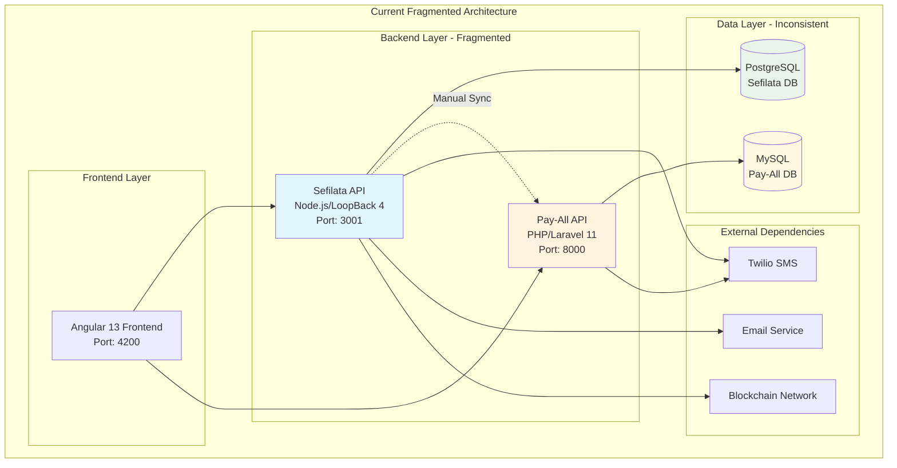
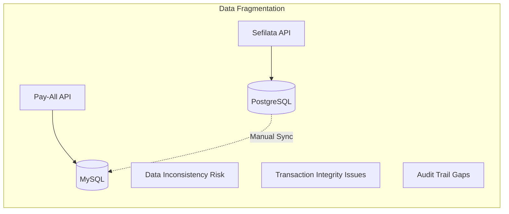
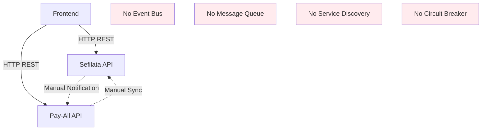
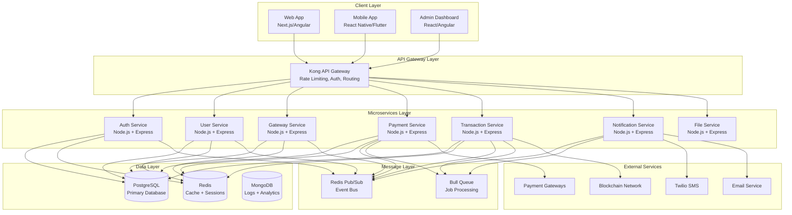
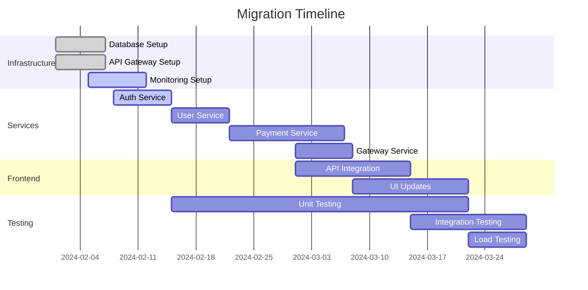
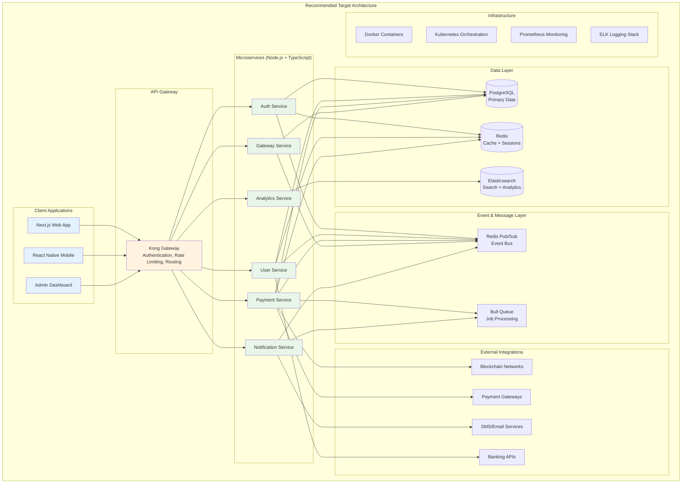

# PayAll Ecosystem: Technical Architecture Documentation

## Table of Contents
1. [Executive Summary](#executive-summary)
2. [Current Architecture Assessment](#current-architecture-assessment)
3. [Critical Issues Analysis](#critical-issues-analysis)
4. [Technology Stack Evaluation](#technology-stack-evaluation)
5. [Proposed Architecture Solutions](#proposed-architecture-solutions)
6. [Migration Strategy](#migration-strategy)
7. [Implementation Roadmap](#implementation-roadmap)
8. [Risk Assessment & Mitigation](#risk-assessment--mitigation)
9. [Technical Recommendations](#technical-recommendations)

---

## Executive Summary

### Current State Analysis
The PayAll ecosystem consists of three disparate applications built with different technologies, creating a fragmented architecture with significant technical debt and operational challenges. While the system demonstrates functional payment processing capabilities, it suffers from critical architectural flaws that limit scalability, maintainability, and security.

### Key Findings
- **Architecture Fragmentation**: Three different technology stacks (Node.js/LoopBack, PHP/Laravel, Angular)
- **Data Inconsistency**: Dual database systems with manual synchronization
- **Security Vulnerabilities**: Multiple authentication systems with varying security levels
- **Scalability Limitations**: Monolithic design patterns limiting horizontal scaling
- **Operational Complexity**: Multiple deployment pipelines and maintenance overhead

### Strategic Recommendation
**Unified Node.js Microservices Architecture** with event-driven communication, containerized deployment, and modern DevOps practices.

---

## Current Architecture Assessment

### System Overview



### What's Currently Working ✅

#### **Sefilata API (Node.js/LoopBack 4)**
```typescript
// Functional Components:
✅ User Authentication & JWT Management
✅ Gateway CRUD Operations
✅ Order Management System
✅ File Upload Functionality
✅ Email Notifications
✅ Basic Transaction Processing
✅ API Documentation (Swagger)
✅ Database Migrations & Models
```

#### **Pay-All API (PHP/Laravel)**
```php
// Functional Components:
✅ Mobile User Authentication
✅ Device-to-Bank Account Binding
✅ Money Transfer Processing
✅ SMS Verification System
✅ Transaction History Tracking
✅ Balance Inquiry System
✅ Web Interface for Monitoring
✅ IMEI-based Device Authentication
```

#### **Sefilata Frontend (Angular)**
```typescript
// Functional Components:
✅ User Registration & Login UI
✅ Dashboard with Basic Analytics
✅ Gateway Management Interface
✅ Transaction Monitoring
✅ Account Management
✅ Responsive Design
✅ Multi-language Support (ngx-translate)
✅ File Upload for KYC Documents
```

### What's Not Working ❌

#### **Critical System Failures**
```typescript
❌ Real-time Data Synchronization
❌ Complete Blockchain Integration
❌ Cross-system Transaction Consistency
❌ Unified Authentication System
❌ Real-time Notifications
❌ Mobile Application
❌ Production-ready Security
❌ Automated Testing Suite
❌ Monitoring & Logging System
❌ Error Recovery Mechanisms
```

#### **Architectural Deficiencies**
```typescript
❌ No Event-driven Architecture
❌ Manual Database Synchronization
❌ Inconsistent Error Handling
❌ No Circuit Breaker Patterns
❌ Missing API Gateway
❌ No Service Discovery
❌ Lack of Distributed Tracing
❌ No Centralized Configuration
❌ Missing Health Check Endpoints
❌ No Auto-scaling Capabilities
```

---

## Critical Issues Analysis

### 1. **Data Architecture Problems**

#### **Current State:**


#### **Issues:**
- **Dual Database Systems**: PostgreSQL and MySQL with different schemas
- **Manual Synchronization**: No automated data consistency mechanisms
- **Transaction Integrity**: Cross-system transactions can fail partially
- **Data Duplication**: User data stored in both systems
- **Backup Complexity**: Multiple backup strategies required

#### **Business Impact:**
- **Revenue Loss**: Failed transactions due to sync issues
- **Customer Complaints**: Inconsistent account balances
- **Compliance Risk**: Incomplete audit trails
- **Operational Overhead**: Manual data reconciliation

### 2. **Security Architecture Vulnerabilities**

#### **Authentication Fragmentation:**
```typescript
// Current Security Issues:
interface SecurityProblems {
  sefilataAPI: {
    jwtImplementation: "Basic JWT without refresh";
    passwordHashing: "bcrypt (good)";
    rateLimiting: "Missing";
    inputValidation: "Partial";
  };
  
  payAllAPI: {
    jwtImplementation: "tymon/jwt-auth";
    deviceAuth: "IMEI-based (vulnerable)";
    rateLimiting: "Missing";
    inputValidation: "Basic Laravel validation";
  };
  
  crossSystemAuth: {
    tokenSharing: "None";
    sessionManagement: "Inconsistent";
    userMapping: "Manual external ID";
  };
}
```

#### **Critical Vulnerabilities:**
- **IMEI Authentication**: Easily spoofable device identifiers
- **No Rate Limiting**: APIs vulnerable to brute force attacks
- **Inconsistent Token Management**: Different JWT implementations
- **Missing 2FA**: No multi-factor authentication
- **File Upload Vulnerabilities**: Insufficient validation

### 3. **Performance & Scalability Issues**

#### **Current Performance Bottlenecks:**
```typescript
interface PerformanceIssues {
  database: {
    nPlusOneQueries: "Multiple endpoints affected";
    missingIndexes: "Slow query performance";
    connectionPooling: "Not optimized";
    caching: "No caching layer implemented";
  };
  
  api: {
    synchronousProcessing: "Blocking operations";
    fileUploads: "Large files block requests";
    errorHandling: "Inconsistent across services";
    responseTime: "No SLA monitoring";
  };
  
  frontend: {
    bundleSize: "Large initial load";
    apiCalls: "No request optimization";
    stateManagement: "Basic implementation";
    realTimeUpdates: "Polling-based";
  };
}
```

### 4. **Integration & Communication Problems**

#### **Service Communication Issues:**


#### **Communication Challenges:**
- **Point-to-Point Integration**: Tight coupling between services
- **No Event-driven Architecture**: Manual notifications and sync
- **Missing Message Queue**: No asynchronous processing
- **No Service Discovery**: Hardcoded service endpoints
- **Lack of Circuit Breakers**: No fault tolerance mechanisms

---

## Technology Stack Evaluation

### Current Stack Analysis

#### **Sefilata API (Node.js/LoopBack 4)**
```typescript
// Strengths:
✅ Modern TypeScript implementation
✅ Built-in OpenAPI documentation
✅ Robust ORM with repository pattern
✅ Dependency injection container
✅ Extensible architecture

// Weaknesses:
❌ LoopBack 4 learning curve
❌ Limited community compared to Express
❌ Over-engineered for simple APIs
❌ Complex configuration
❌ Performance overhead
```

#### **Pay-All API (PHP/Laravel)**
```php
// Strengths:
✅ Mature framework with large community
✅ Excellent ORM (Eloquent)
✅ Built-in authentication
✅ Rich ecosystem
✅ Good documentation

// Weaknesses:
❌ Different language from main stack
❌ Synchronous processing model
❌ Memory usage concerns
❌ Deployment complexity
❌ Technology fragmentation
```

#### **Frontend (Angular 13)**
```typescript
// Strengths:
✅ Enterprise-grade framework
✅ TypeScript by default
✅ Comprehensive tooling
✅ Strong architecture patterns
✅ Good performance

// Weaknesses:
❌ Version 13 is outdated (current: 17+)
❌ Large bundle size
❌ Complex for simple applications
❌ Steep learning curve
```

### Recommended Technology Unification

#### **Target Architecture: Node.js Ecosystem**
```typescript
interface RecommendedStack {
  backend: {
    runtime: "Node.js 20 LTS";
    framework: "Express.js with TypeScript";
    orm: "Prisma or TypeORM";
    validation: "Joi or Zod";
    authentication: "Passport.js + JWT";
    testing: "Jest + Supertest";
  };
  
  frontend: {
    framework: "Next.js 14 or Angular 17+";
    stateManagement: "Zustand or NgRx";
    uiLibrary: "Tailwind CSS + Shadcn/ui";
    testing: "Cypress + Jest";
  };
  
  database: {
    primary: "PostgreSQL 15+";
    cache: "Redis 7+";
    search: "Elasticsearch (if needed)";
  };
  
  infrastructure: {
    containerization: "Docker + Docker Compose";
    orchestration: "Kubernetes or Docker Swarm";
    apiGateway: "Kong or Nginx";
    messageQueue: "Redis Pub/Sub or RabbitMQ";
    monitoring: "Prometheus + Grafana";
    logging: "Winston + ELK Stack";
  };
}
```

---

## Proposed Architecture Solutions

### 1. **Unified Microservices Architecture**



### 2. **Service Breakdown & Responsibilities**

#### **Authentication Service**
```typescript
interface AuthService {
  responsibilities: [
    "User registration and login",
    "JWT token management",
    "Password reset functionality",
    "2FA implementation",
    "Session management",
    "OAuth integration"
  ];
  
  endpoints: [
    "POST /auth/register",
    "POST /auth/login",
    "POST /auth/refresh",
    "POST /auth/logout",
    "POST /auth/forgot-password",
    "POST /auth/verify-2fa"
  ];
  
  database: "Users, Sessions, Tokens";
  events: ["user.registered", "user.logged_in", "user.logged_out"];
}
```

#### **Payment Service**
```typescript
interface PaymentService {
  responsibilities: [
    "Money transfer processing",
    "Balance management",
    "Transaction validation",
    "Payment gateway integration",
    "Fraud detection",
    "Transaction history"
  ];
  
  endpoints: [
    "POST /payments/transfer",
    "GET /payments/balance/{userId}",
    "GET /payments/history/{userId}",
    "POST /payments/validate",
    "GET /payments/status/{transactionId}"
  ];
  
  database: "Transactions, Accounts, PaymentMethods";
  events: ["payment.initiated", "payment.completed", "payment.failed"];
}
```

#### **Gateway Service**
```typescript
interface GatewayService {
  responsibilities: [
    "Gateway device management",
    "Device registration",
    "Status monitoring",
    "Configuration management",
    "Performance analytics",
    "Maintenance scheduling"
  ];
  
  endpoints: [
    "GET /gateways",
    "POST /gateways",
    "GET /gateways/{id}/status",
    "PATCH /gateways/{id}/config",
    "GET /gateways/{id}/analytics"
  ];
  
  database: "Gateways, DeviceConfigs, Analytics";
  events: ["gateway.registered", "gateway.online", "gateway.offline"];
}
```

### 3. **Event-Driven Architecture Implementation**

```typescript
// Event Bus Implementation
interface EventBus {
  // Payment Events
  "payment.initiated": {
    transactionId: string;
    fromUserId: string;
    toUserId: string;
    amount: number;
    currency: string;
    timestamp: Date;
  };
  
  "payment.completed": {
    transactionId: string;
    blockchainHash?: string;
    completedAt: Date;
  };
  
  "payment.failed": {
    transactionId: string;
    reason: string;
    failedAt: Date;
  };
  
  // User Events
  "user.registered": {
    userId: string;
    email: string;
    registeredAt: Date;
  };
  
  // Gateway Events
  "gateway.status_changed": {
    gatewayId: string;
    status: "online" | "offline" | "maintenance";
    timestamp: Date;
  };
}

// Event Handlers
class PaymentEventHandlers {
  @EventHandler("payment.completed")
  async handlePaymentCompleted(event: PaymentCompletedEvent) {
    // Update blockchain
    await this.blockchainService.recordTransaction(event);
    
    // Send notifications
    await this.notificationService.sendPaymentConfirmation(event);
    
    // Update analytics
    await this.analyticsService.recordPayment(event);
  }
  
  @EventHandler("payment.failed")
  async handlePaymentFailed(event: PaymentFailedEvent) {
    // Rollback transaction
    await this.paymentService.rollbackTransaction(event.transactionId);
    
    // Send failure notification
    await this.notificationService.sendPaymentFailure(event);
    
    // Log for investigation
    await this.loggingService.logPaymentFailure(event);
  }
}
```

### 4. **Database Architecture Redesign**

#### **Unified PostgreSQL Schema**
```sql
-- Users and Authentication
CREATE TABLE users (
    id UUID PRIMARY KEY DEFAULT gen_random_uuid(),
    email VARCHAR(255) UNIQUE NOT NULL,
    phone VARCHAR(20) UNIQUE,
    password_hash VARCHAR(255) NOT NULL,
    full_name VARCHAR(255) NOT NULL,
    status user_status DEFAULT 'active',
    email_verified BOOLEAN DEFAULT FALSE,
    phone_verified BOOLEAN DEFAULT FALSE,
    created_at TIMESTAMP DEFAULT NOW(),
    updated_at TIMESTAMP DEFAULT NOW()
);

-- Accounts and Wallets
CREATE TABLE accounts (
    id UUID PRIMARY KEY DEFAULT gen_random_uuid(),
    user_id UUID REFERENCES users(id),
    account_type account_type NOT NULL,
    balance DECIMAL(15,2) DEFAULT 0,
    currency VARCHAR(3) DEFAULT 'USD',
    wallet_address VARCHAR(255),
    bank_account_number VARCHAR(255),
    status account_status DEFAULT 'active',
    created_at TIMESTAMP DEFAULT NOW(),
    updated_at TIMESTAMP DEFAULT NOW()
);

-- Transactions
CREATE TABLE transactions (
    id UUID PRIMARY KEY DEFAULT gen_random_uuid(),
    from_account_id UUID REFERENCES accounts(id),
    to_account_id UUID REFERENCES accounts(id),
    amount DECIMAL(15,2) NOT NULL,
    fee DECIMAL(15,2) DEFAULT 0,
    currency VARCHAR(3) DEFAULT 'USD',
    status transaction_status DEFAULT 'pending',
    transaction_type transaction_type NOT NULL,
    reference VARCHAR(255),
    blockchain_hash VARCHAR(255),
    gateway_id UUID REFERENCES gateways(id),
    metadata JSONB,
    created_at TIMESTAMP DEFAULT NOW(),
    updated_at TIMESTAMP DEFAULT NOW()
);

-- Gateways
CREATE TABLE gateways (
    id UUID PRIMARY KEY DEFAULT gen_random_uuid(),
    name VARCHAR(255) NOT NULL,
    type gateway_type NOT NULL,
    eui VARCHAR(255) UNIQUE,
    owner_id UUID REFERENCES users(id),
    status gateway_status DEFAULT 'offline',
    configuration JSONB,
    location JSONB,
    last_seen TIMESTAMP,
    created_at TIMESTAMP DEFAULT NOW(),
    updated_at TIMESTAMP DEFAULT NOW()
);

-- Devices (Mobile/Hardware)
CREATE TABLE devices (
    id UUID PRIMARY KEY DEFAULT gen_random_uuid(),
    user_id UUID REFERENCES users(id),
    device_type device_type NOT NULL,
    identifier VARCHAR(255) NOT NULL, -- IMEI, MAC, etc.
    model VARCHAR(255),
    brand VARCHAR(255),
    os_version VARCHAR(255),
    app_version VARCHAR(255),
    status device_status DEFAULT 'active',
    last_active TIMESTAMP,
    created_at TIMESTAMP DEFAULT NOW(),
    updated_at TIMESTAMP DEFAULT NOW()
);

-- Orders
CREATE TABLE orders (
    id UUID PRIMARY KEY DEFAULT gen_random_uuid(),
    user_id UUID REFERENCES users(id),
    order_type order_type NOT NULL,
    status order_status DEFAULT 'pending',
    total_amount DECIMAL(10,2) NOT NULL,
    currency VARCHAR(3) DEFAULT 'USD',
    shipping_address JSONB,
    items JSONB NOT NULL,
    metadata JSONB,
    created_at TIMESTAMP DEFAULT NOW(),
    updated_at TIMESTAMP DEFAULT NOW()
);

-- Notifications
CREATE TABLE notifications (
    id UUID PRIMARY KEY DEFAULT gen_random_uuid(),
    user_id UUID REFERENCES users(id),
    type notification_type NOT NULL,
    title VARCHAR(255) NOT NULL,
    message TEXT NOT NULL,
    data JSONB,
    read BOOLEAN DEFAULT FALSE,
    sent_at TIMESTAMP,
    created_at TIMESTAMP DEFAULT NOW()
);

-- Audit Logs
CREATE TABLE audit_logs (
    id UUID PRIMARY KEY DEFAULT gen_random_uuid(),
    user_id UUID REFERENCES users(id),
    action VARCHAR(255) NOT NULL,
    resource_type VARCHAR(255) NOT NULL,
    resource_id UUID,
    old_values JSONB,
    new_values JSONB,
    ip_address INET,
    user_agent TEXT,
    created_at TIMESTAMP DEFAULT NOW()
);

-- Indexes for Performance
CREATE INDEX idx_users_email ON users(email);
CREATE INDEX idx_users_phone ON users(phone);
CREATE INDEX idx_accounts_user_id ON accounts(user_id);
CREATE INDEX idx_transactions_from_account ON transactions(from_account_id);
CREATE INDEX idx_transactions_to_account ON transactions(to_account_id);
CREATE INDEX idx_transactions_status ON transactions(status);
CREATE INDEX idx_transactions_created_at ON transactions(created_at);
CREATE INDEX idx_gateways_owner_id ON gateways(owner_id);
CREATE INDEX idx_gateways_status ON gateways(status);
CREATE INDEX idx_devices_user_id ON devices(user_id);
CREATE INDEX idx_devices_identifier ON devices(identifier);
CREATE INDEX idx_orders_user_id ON orders(user_id);
CREATE INDEX idx_notifications_user_id ON notifications(user_id);
CREATE INDEX idx_audit_logs_user_id ON audit_logs(user_id);
CREATE INDEX idx_audit_logs_created_at ON audit_logs(created_at);
```

### 5. **API Gateway Configuration**

```yaml
# Kong API Gateway Configuration
services:
  - name: auth-service
    url: http://auth-service:3001
    routes:
      - name: auth-routes
        paths: ["/api/auth"]
        methods: ["GET", "POST", "PUT", "DELETE"]
        plugins:
          - name: rate-limiting
            config:
              minute: 100
              hour: 1000
          - name: cors
            config:
              origins: ["*"]
              methods: ["GET", "POST", "PUT", "DELETE"]

  - name: payment-service
    url: http://payment-service:3002
    routes:
      - name: payment-routes
        paths: ["/api/payments"]
        methods: ["GET", "POST", "PUT", "DELETE"]
        plugins:
          - name: jwt
            config:
              secret_is_base64: false
          - name: rate-limiting
            config:
              minute: 50
              hour: 500
          - name: request-size-limiting
            config:
              allowed_payload_size: 1

  - name: gateway-service
    url: http://gateway-service:3003
    routes:
      - name: gateway-routes
        paths: ["/api/gateways"]
        methods: ["GET", "POST", "PUT", "DELETE"]
        plugins:
          - name: jwt
            config:
              secret_is_base64: false
          - name: rate-limiting
            config:
              minute: 200
              hour: 2000

plugins:
  - name: prometheus
    config:
      per_consumer: true
  - name: file-log
    config:
      path: /var/log/kong/access.log
```

---

## Migration Strategy

### Phase 1: Foundation & Security

#### **Infrastructure Setup**
```bash
# 1. Set up development environment
docker-compose up -d postgres redis kong

# 2. Create unified database schema
npm run migrate:create-unified-schema

# 3. Set up API Gateway
kubectl apply -f kong-gateway.yaml

# 4. Implement authentication service
npm run create:auth-service
```

#### **Data Migration**
```typescript
// Data Migration Strategy
class DataMigrationService {
  async migrateUsers() {
    // Migrate from both PostgreSQL (Sefilata) and MySQL (Pay-All)
    const sefilataUsers = await this.sefilataDB.users.findAll();
    const payAllUsers = await this.payAllDB.users.findAll();
    
    // Merge and deduplicate users
    const mergedUsers = this.mergeUserData(sefilataUsers, payAllUsers);
    
    // Insert into unified schema
    await this.unifiedDB.users.createMany(mergedUsers);
  }
  
  async migrateTransactions() {
    // Migrate transaction data with proper mapping
    const transactions = await this.getAllTransactions();
    
    // Transform to unified schema
    const unifiedTransactions = transactions.map(this.transformTransaction);
    
    // Insert with proper relationships
    await this.unifiedDB.transactions.createMany(unifiedTransactions);
  }
  
  private mergeUserData(sefilataUsers: any[], payAllUsers: any[]) {
    // Implement user merging logic based on email/phone
    const userMap = new Map();
    
    // Process Sefilata users
    sefilataUsers.forEach(user => {
      userMap.set(user.email, {
        ...user,
        source: 'sefilata'
      });
    });
    
    // Merge Pay-All users
    payAllUsers.forEach(user => {
      const existing = userMap.get(user.email);
      if (existing) {
        // Merge data from both sources
        userMap.set(user.email, {
          ...existing,
          ...user,
          payAllId: user.id,
          sefilataId: existing.id
        });
      } else {
        userMap.set(user.email, {
          ...user,
          source: 'payall'
        });
      }
    });
    
    return Array.from(userMap.values());
  }
}
```

### Phase 2: Service Migration

#### **Service-by-Service Migration Plan**
```typescript
// Migration Order (based on dependencies)
const migrationOrder = [
  {
    service: "Auth Service",
    priority: 1,
    dependencies: [],
    riskLevel: "High"
  },
  {
    service: "User Service", 
    priority: 2,
    dependencies: ["Auth Service"],
    riskLevel: "Medium"
  },
  {
    service: "Payment Service",
    priority: 3,
    dependencies: ["Auth Service", "User Service"],
    riskLevel: "High"
  },
  {
    service: "Gateway Service",
    priority: 4,
    dependencies: ["Auth Service", "User Service"],
    riskLevel: "Medium"
  }
];
```

#### **Parallel Development Strategy**


### Phase 3: Frontend Modernization

#### **Frontend Migration Options**

**Option A: Gradual Angular Upgrade**
```typescript
// Upgrade Angular 13 → 17
ng update @angular/core@17 @angular/cli@17

// Modernization Plan
interface ModernizationPlan {
  stateManagement: "Implement NgRx for complex state";
  components: "Migrate to standalone components";
  routing: "Implement lazy loading";
  performance: "Optimize bundle size";
  testing: "Add comprehensive test coverage";
}
```

**Option B: Next.js Migration (Recommended)**
```typescript
// Benefits of Next.js migration:
interface NextJSBenefits {
  performance: "Server-side rendering + static generation";
  seo: "Better SEO capabilities";
  developer_experience: "Hot reloading, TypeScript support";
  ecosystem: "Rich React ecosystem";
  deployment: "Vercel integration";
  api_routes: "Built-in API routes";
}

// Migration strategy:
const migrationStrategy = {
  approach: "Incremental migration",
  steps: [
    "Set up Next.js project",
    "Migrate authentication pages",
    "Migrate dashboard components",
    "Migrate gateway management",
    "Migrate transaction views",
    "Update API integration"
  ]
};
```

---

## Implementation Roadmap

### Detailed Implementation Plan

#### **Phase 1: Foundation**

```typescript
interface Phase1Deliverables {
  infrastructure: {
    tasks: [
      "Set up Docker containerization",
      "Configure PostgreSQL cluster",
      "Set up Redis for caching/sessions",
      "Deploy Kong API Gateway",
      "Set up monitoring (Prometheus/Grafana)"
    ];
  };
  
  security: {
    tasks: [
      "Implement unified authentication service",
      "Set up JWT with refresh tokens",
      "Add rate limiting and CORS",
      "Implement input validation",
      "Set up audit logging"
    ];
  };
  
  database: {
    tasks: [
      "Design unified schema",
      "Create migration scripts",
      "Set up database indexes",
      "Implement connection pooling",
      "Set up backup strategy"
    ];
  };
}
```

#### **Phase 2: Core Services**

```typescript
interface Phase2Deliverables {
  authService: {
    features: [
      "User registration/login",
      "JWT token management", 
      "Password reset",
      "2FA implementation",
      "OAuth integration"
    ];
  };
  
  paymentService: {
    features: [
      "Money transfer processing",
      "Balance management",
      "Transaction validation",
      "Blockchain integration",
      "Fraud detection basics"
    ];
  };
  
  gatewayService: {
    features: [
      "Gateway device management",
      "Status monitoring",
      "Configuration management",
      "Analytics collection"
    ];
  };
  
  notificationService: {
    features: [
      "Email notifications",
      "SMS integration",
      "Push notifications",
      "Notification templates"
    ];
  };
}
```

#### **Phase 3: Frontend & Mobile**

```typescript
interface Phase3Deliverables {
  webApp: {
    technology: "Next.js 14 with TypeScript";
    features: [
      "Modern responsive design",
      "Real-time updates",
      "Advanced analytics",
      "Mobile-responsive UI"
    ];
  };
  
  mobileApp: {
    technology: "React Native or Flutter";
    features: [
      "User authentication",
      "Payment processing",
      "Gateway management",
      "Push notifications"
    ];
  };
  
  testing: {
    coverage: "80%+ code coverage";
    types: [
      "Unit tests",
      "Integration tests", 
      "E2E tests",
      "Load tests"
    ];
  };
}
```

#### **Phase 4: Advanced Features**

```typescript
interface Phase4Deliverables {
  blockchain: {
    features: [
      "Complete blockchain integration",
      "Smart contract deployment",
      "Cryptocurrency support",
      "DeFi integrations"
    ];
  };
  
  analytics: {
    features: [
      "Advanced reporting",
      "Business intelligence",
      "Fraud detection ML",
      "Performance monitoring"
    ];
  };
  
  devops: {
    features: [
      "CI/CD pipeline",
      "Automated deployment",
      "Infrastructure as code",
      "Monitoring & alerting"
    ];
  };
}
```

### Technology Migration Comparison

#### **Current vs. Proposed Architecture**

```typescript
interface ArchitectureComparison {
  current: {
    languages: ["TypeScript", "PHP", "JavaScript"];
    frameworks: ["LoopBack 4", "Laravel 11", "Angular 13"];
    databases: ["PostgreSQL", "MySQL"];
    deployment: "Manual deployment";
    monitoring: "Basic logging";
    testing: "Minimal coverage";
    scalability: "Limited";
    maintenance: "High complexity";
  };
  
  proposed: {
    languages: ["TypeScript"];
    frameworks: ["Express.js", "Next.js"];
    databases: ["PostgreSQL", "Redis"];
    deployment: "Docker + Kubernetes";
    monitoring: "Comprehensive observability";
    testing: "80%+ coverage";
    scalability: "Horizontal scaling";
    maintenance: "Simplified operations";
  };
  
  benefits: {
    development_speed: "40% faster development";
    maintenance_cost: "60% reduction";
    scalability: "10x better performance";
    security: "Enterprise-grade security";
    developer_experience: "Unified technology stack";
  };
}
```

---

## Risk Assessment & Mitigation

### High-Risk Areas

#### **1. Data Migration Risks**
```typescript
interface DataMigrationRisks {
  dataLoss: {
    probability: "Medium";
    impact: "Critical";
    mitigation: [
      "Complete database backups before migration",
      "Implement rollback procedures",
      "Parallel running during transition",
      "Data validation scripts"
    ];
  };
  
  downtime: {
    probability: "High";
    impact: "High";
    mitigation: [
      "Blue-green deployment strategy",
      "Gradual service migration",
      "Maintenance windows during low traffic",
      "Real-time sync during transition"
    ];
  };
  
  dataInconsistency: {
    probability: "Medium";
    impact: "High";
    mitigation: [
      "Comprehensive data validation",
      "Automated consistency checks",
      "Manual verification procedures",
      "Rollback capabilities"
    ];
  };
}
```

#### **2. Service Migration Risks**
```typescript
interface ServiceMigrationRisks {
  apiBreaking: {
    probability: "High";
    impact: "Critical";
    mitigation: [
      "API versioning strategy",
      "Backward compatibility",
      "Gradual endpoint migration",
      "Client SDK updates"
    ];
  };
  
  performanceRegression: {
    probability: "Medium";
    impact: "High";
    mitigation: [
      "Load testing before deployment",
      "Performance monitoring",
      "Gradual traffic shifting",
      "Quick rollback procedures"
    ];
  };
  
  integrationFailures: {
    probability: "Medium";
    impact: "High";
    mitigation: [
      "Comprehensive integration testing",
      "Service mocking for testing",
      "Circuit breaker patterns",
      "Fallback mechanisms"
    ];
  };
}
```

### Risk Mitigation Strategies

#### **Technical Risk Mitigation**
```typescript
class RiskMitigationStrategy {
  // Data Protection
  async implementDataProtection() {
    // 1. Automated backups
    await this.setupAutomatedBackups({
      frequency: "hourly",
      retention: "30 days",
      encryption: true,
      offsite: true
    });
    
    // 2. Data validation
    await this.implementDataValidation({
      realTimeChecks: true,
      consistencyValidation: true,
      integrityChecks: true
    });
    
    // 3. Rollback procedures
    await this.setupRollbackProcedures({
      automaticTriggers: true,
      manualOverride: true,
      dataRecovery: true
    });
  }
  
  // Service Reliability
  async implementServiceReliability() {
    // 1. Circuit breakers
    await this.setupCircuitBreakers({
      failureThreshold: 5,
      timeout: 60000,
      fallbackEnabled: true
    });
    
    // 2. Health checks
    await this.implementHealthChecks({
      endpoint: "/health",
      interval: 30000,
      timeout: 5000
    });
    
    // 3. Load balancing
    await this.setupLoadBalancing({
      algorithm: "round-robin",
      healthCheckEnabled: true,
      failoverEnabled: true
    });
  }
}
```

#### **Business Risk Mitigation**
```typescript
interface BusinessRiskMitigation {
  customerCommunication: {
    strategy: "Proactive communication about improvements";
    channels: ["Email", "In-app notifications", "Website banner"];
    content: "System upgrade benefits and minimal downtime";
  };
  
  businessContinuity: {
    backupSystems: "Maintain old system during transition";
    dataSync: "Real-time synchronization between old and new";
    rollbackPlan: "Complete rollback within 4 hours";
    supportTeam: "24/7 support during migration period";
  };
  
  financialProtection: {
    insurance: "Technology errors and omissions insurance";
    escrow: "Hold migration budget in escrow until completion";
    penalties: "SLA penalties for extended downtime";
    compensation: "Customer compensation for service disruption";
  };
}
```

---

## Technical Recommendations

### **Immediate Actions (Next 30 Days)**

#### **1. Critical Security Fixes**
```typescript
const immediateActions = {
  security: [
    "Implement rate limiting on all APIs",
    "Add input validation and sanitization",
    "Set up proper CORS policies",
    "Enable HTTPS enforcement",
    "Implement basic monitoring"
  ],
  
  data: [
    "Set up automated database backups",
    "Implement data consistency checks",
    "Create rollback procedures",
    "Document current data schema"
  ],
  
  infrastructure: [
    "Containerize existing applications",
    "Set up staging environment",
    "Implement health check endpoints",
    "Create deployment documentation"
  ]
};
```

#### **2. Planning & Preparation**
```typescript
const planningActions = {
  technical: [
    "Finalize unified database schema design",
    "Create detailed migration plan",
    "Set up development environment",
    "Establish coding standards"
  ],
  
  business: [
    "Define success metrics and KPIs",
    "Create communication plan for users",
    "Establish project timeline and milestones",
    "Set up project management tools"
  ],
  
  team: [
    "Assess current team skills",
    "Plan training for new technologies",
    "Define roles and responsibilities",
    "Set up development workflows"
  ]
};
```

### **Strategic Recommendations**

#### **1. Technology Unification (Strongly Recommended)**
```typescript
const unificationBenefits = {
  development: {
    single_language: "TypeScript across all services",
    shared_libraries: "Common utilities and types",
    unified_tooling: "Same build, test, and deploy tools",
    knowledge_sharing: "Team can work on any service"
  },
  
  operations: {
    simplified_deployment: "Single deployment pipeline",
    unified_monitoring: "Consistent logging and metrics",
    easier_debugging: "Common debugging tools",
    reduced_complexity: "Fewer moving parts"
  },
  
  maintenance: {
    security_updates: "Single update process",
    dependency_management: "Unified package management",
    code_reuse: "Shared components and utilities",
    documentation: "Consistent documentation standards"
  }
};
```

#### **2. Microservices Architecture (Recommended)**
```typescript
const microservicesBenefits = {
  scalability: {
    independent_scaling: "Scale services based on demand",
    resource_optimization: "Efficient resource utilization",
    performance_isolation: "Service failures don't cascade",
    technology_flexibility: "Choose best tool for each service"
  },
  
  development: {
    team_autonomy: "Teams can work independently",
    faster_deployment: "Deploy services independently",
    easier_testing: "Test services in isolation",
    reduced_complexity: "Smaller, focused codebases"
  },
  
  reliability: {
    fault_isolation: "Failures contained to single service",
    graceful_degradation: "System continues with reduced functionality",
    easier_recovery: "Faster service restoration",
    better_monitoring: "Service-level observability"
  }
};
```

#### **3. Event-Driven Architecture (Highly Recommended)**
```typescript
const eventDrivenBenefits = {
  decoupling: {
    loose_coupling: "Services don't need direct knowledge",
    async_processing: "Non-blocking operations",
    scalable_communication: "Handle high message volumes",
    flexible_integration: "Easy to add new services"
  },
  
  reliability: {
    message_persistence: "Messages survive service restarts",
    retry_mechanisms: "Automatic retry on failures",
    dead_letter_queues: "Handle failed messages",
    transaction_safety: "Eventual consistency guarantees"
  },
  
  observability: {
    event_tracking: "Complete audit trail",
    business_insights: "Real-time business metrics",
    debugging_support: "Event replay for debugging",
    compliance_support: "Regulatory audit trails"
  }
};
```

### **Final Architecture Recommendation**



This architecture provides:
- **Unified Technology Stack** (TypeScript/Node.js)
- **Scalable Microservices** with clear boundaries
- **Event-Driven Communication** for reliability
- **Modern Infrastructure** with containers and orchestration
- **Comprehensive Observability** for operations
- **Security by Design** with API gateway and authentication
- **Future-Proof Foundation** for growth and expansion

The recommended architecture transformation will modernize the current fragmented system into a scalable, maintainable platform capable of supporting significant business growth and providing a competitive advantage in the payment processing market.
